# PMCPatient-MedSystem-NLP-
基于Gradio架构和数据集PMC_Patients，使用BioBERT、ClinicalBERT等模型的简单Medical NLP Web System🫠  
*ps. 本仓库不提供hugging_face模型以及.pkl模型下载，也不提供数据集，仓库以项目存储为主要目的*

# 🧐☝️Welcome to PMC-Medsystem!🤪🫵

## **主要有以下功能：**
- *数据集可视化*
- *Patient信息查询*
- *病例打分*
- *添加病例*
- *病例规范性&完整性反馈*

## 主界面：
主要有两个页面：DataframeViewer 以及 ContentDetail 分别对应着不同的功能  
### *DataFrameViewer Tab：⬇️*

    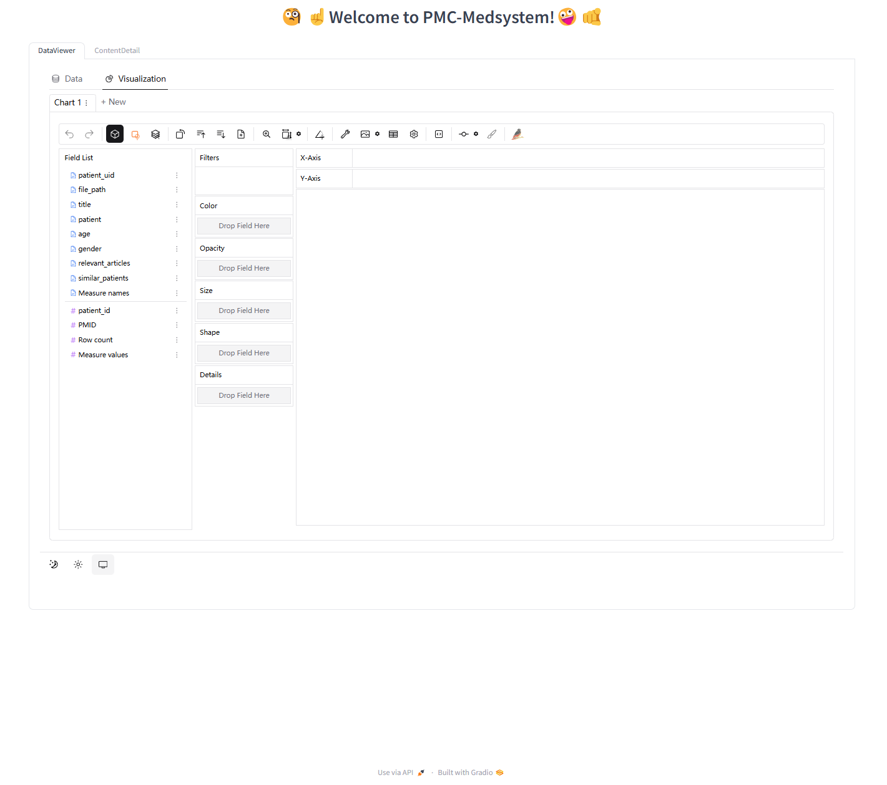

### *ContentDetail Tab：⬇️*

    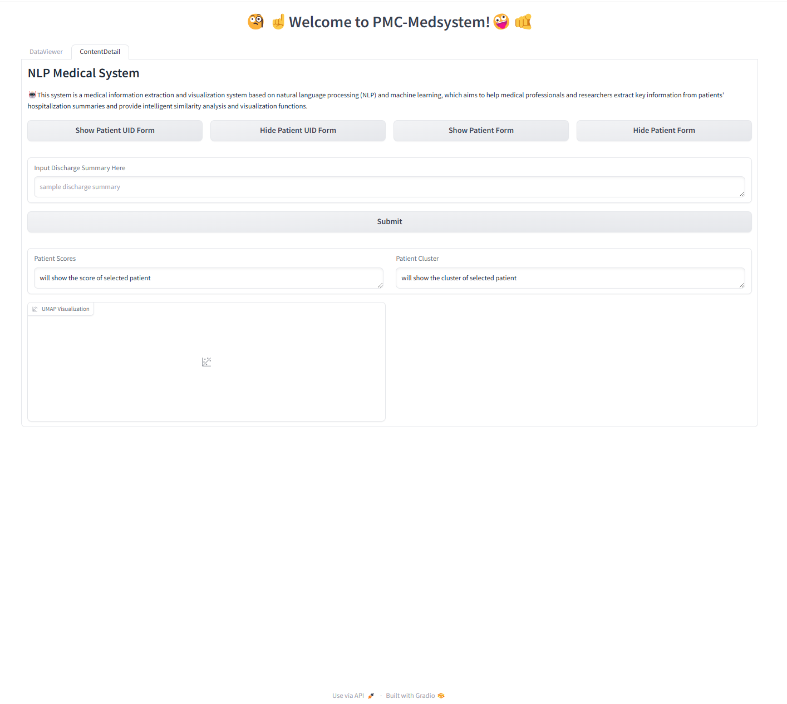

## *DataFrameViewer：*
### 数据集展示
基于强大优秀的pygwalker框架，对本地的数据集进行读取可视化并展示⬇️  

    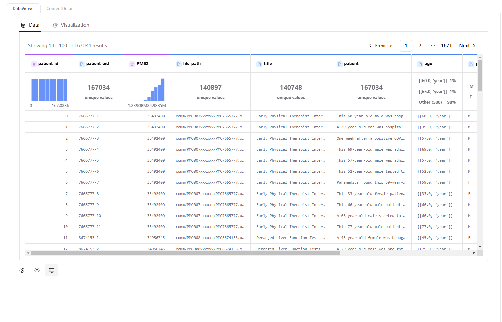

### 数据集可视化：

pygwalker强大的功能还允许使用者自定义进行可视化图标的创建⬇️  
  

    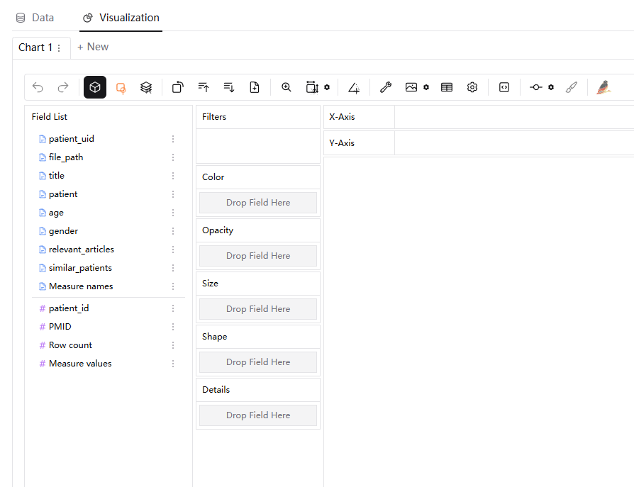

    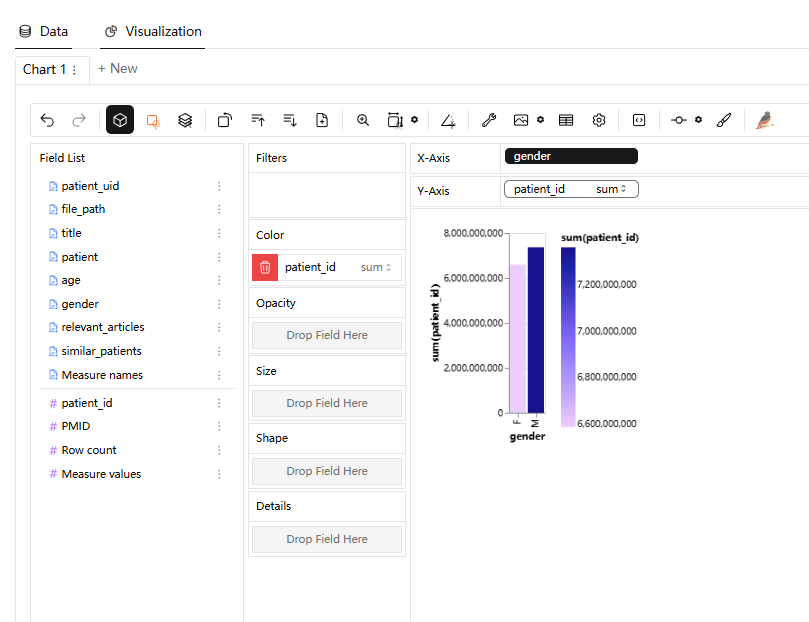

  

## *ContentDetail：*
### Patient信息查询：

    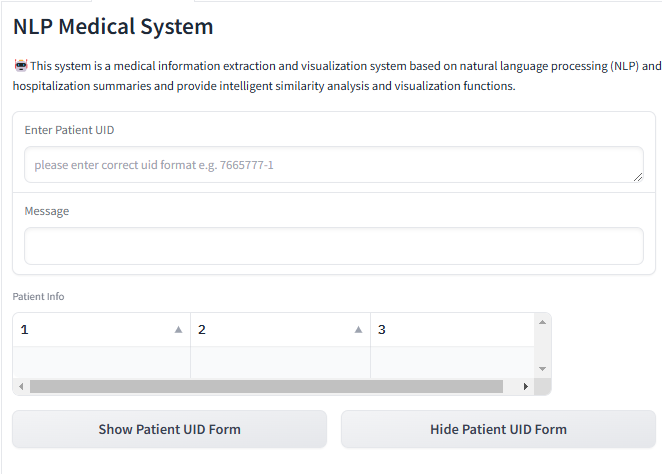

 

在已知待查询病人的UID后，在对应的对话框中输入后，即可获得该病人的更多详细相关信息⬇️

    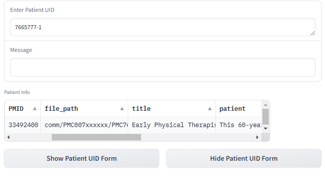

 

### 新增病例：
允许用户进行新的病例输入，并且系统会从完整性和规范性等方面进行打分，最后可以将合格的新增的病例添加至数据集⬇️  

    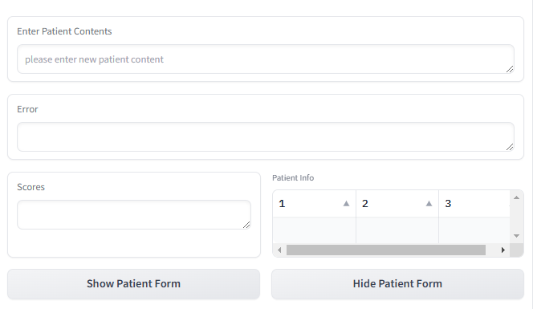

  

    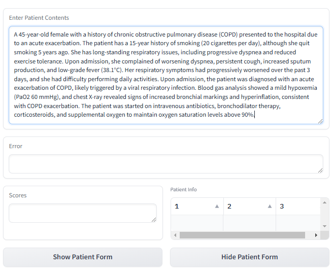

  

### 病例打分
不仅是新输入的病例会进行打分，后续在分析病例的功能中依然会展示打分⬇️  

    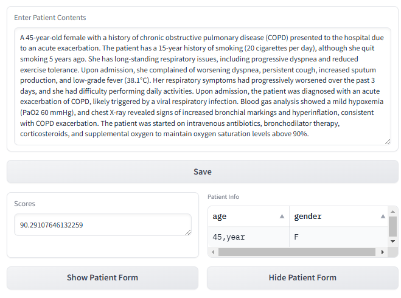

  
合格的新增病例会显示Save按钮即可保存

打分机制如下：  
-*单一属性缺失 -20 (完整性)*  
-*有一处不规范 -1 (规范性)*

基于训练好的模型：   
**nmf_model.pkl：NMF主题模型，已训练好的模型，用于获取文本的主题分布**  
**vectorizer.pkl：向量化器（通常是TF-IDF向量化器），用于将输入的文本转换为向量**  
**umap_model.pkl：UMAP模型，用于将高维的主题分布降维至2D，方便可视化**    
再通过写好的score_softmax进行计算

    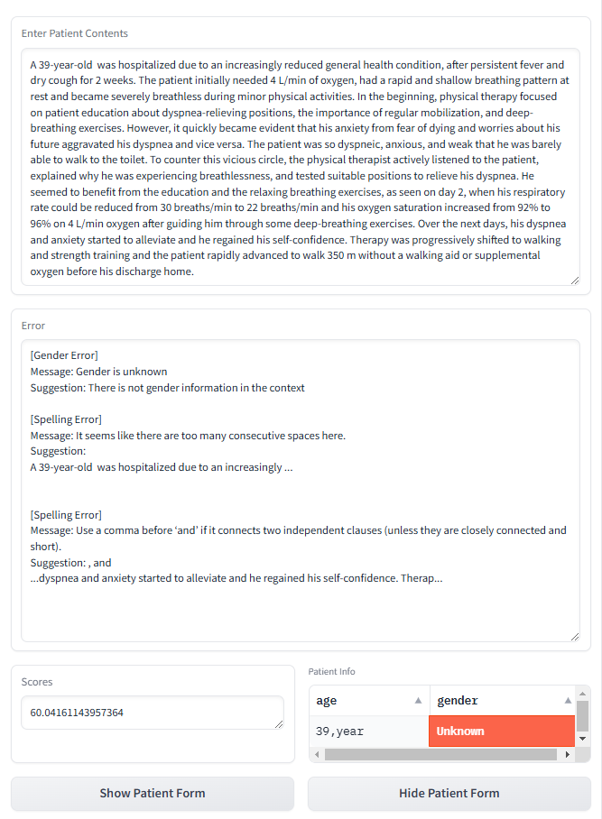

  

### 病例分析
对任何已保存病例进行进一步分析，查询栏只需点击DataFrame展示框即可自动填充，新增栏需要手动复制粘贴至文本框中

    

病例信息提取&分析⬇️

    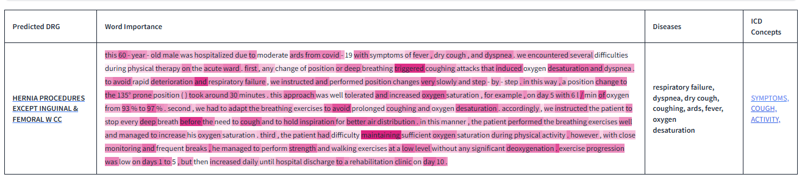

  

Predicted DRG和ICO Concepts都是以可跳转链接形式呈现  
详细信息展示⬇️
#### *分数及所在簇*

    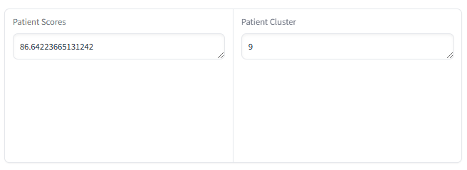

  

#### *相关性分析（余弦相似度）*

    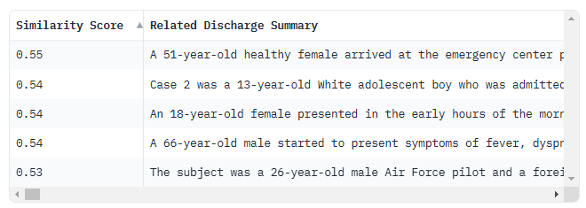

  

#### *簇群可视化*

    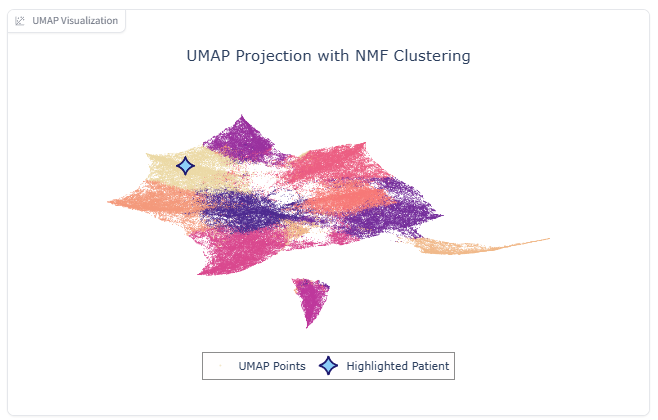

  

# *END*
